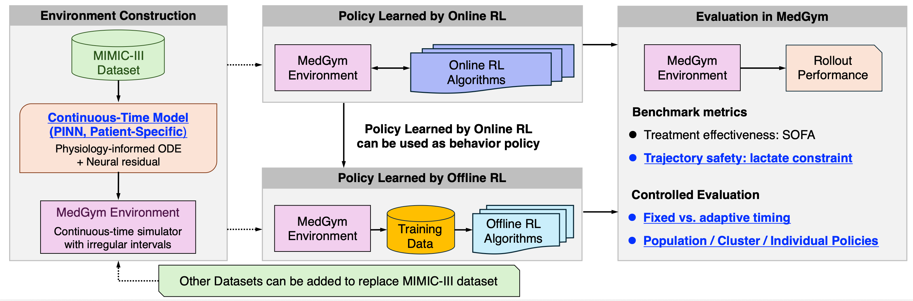

# MedGym-TaCoS


MedGym-TaCoS is a configurable benchmark for reinforcement learning-based dynamic treatment recommendation, extended with cluster-pooled patient simulator settings.

Key features:

- PINN-based continuous-time patient simulators (individual, cluster-pooled, population)
- Irregular treatment and measurement intervals
- Fixed-interval (`fixdt`) and adaptive-interval (`vardt`) policy evaluation
- Online RL: SAC, PPO, TRPO, Lagrangian-PPO, Lagrangian-TRPO
- Offline RL: DQN, CQL, GCQL across individual / cluster-pooled / population scopes
- Safety- and trajectory-level evaluation
- Two disease benchmarks: **sepsis** (MIMIC-III) and **acute hypotension** (Health Gym)

The released artifact includes the trained simulator and policy checkpoints needed to run the benchmark evaluations.



[Workflow diagram (PDF)](assets/Diagram_Benchmarking_Process.pdf)

---

## Data and Checkpoint Availability

### Sepsis benchmark

This repository does **not** redistribute MIMIC-III-derived clinical time-series data.

Policy training and evaluation use the released PINN simulator checkpoints and do **not** require `data/mimic_pinn_v4_filtered.csv`.

The original preprocessed MIMIC-III-derived CSV was used only to construct the released PINN simulators. It contains patient-level clinical time-series data and is not included in this repository.

See `data/README.md` for details on the MIMIC-III preprocessing pipeline and data requirements.

### Acute hypotension benchmark

This repository does **not** redistribute the Health Gym dataset.

The hypotension benchmark uses the **PhysioNet Health Gym — Synthetic Acute Hypotension v1.0.0** dataset. Access requires a PhysioNet account and agreement to the data use terms.

Request access and download at: https://physionet.org/content/synthetic-mimic-iii-health-gym/1.0.0/

After approval, place the CSV at `hypotension/data/hypotension_healthgym.csv`. See `hypotension/data/README.md` for the expected column schema and preprocessing instructions.

---

## Installation

We recommend using `uv`:

```bash
uv sync
```

Alternatively:

```bash
python -m venv .venv
source .venv/bin/activate
pip install -e .
```

YAML-based configuration requires `pyyaml`.

---

## Download Checkpoints

Checkpoints are released as `.tar.zst` archives on HuggingFace.

```bash
pip install -U huggingface_hub
huggingface-cli login
```

### Sepsis checkpoints

#### checkpoints-cohort (~2.1 GB)

Contains PINN and online/offline policy checkpoints for 7 cohorts (cohort_1 – cohort_7). Cohort_7 also includes pre-trained offline policies.

```bash
huggingface-cli download Kenkawano/medgym \
    checkpoints-cohort.tar.zst --repo-type dataset --local-dir .
tar --zstd -xf checkpoints-cohort.tar.zst
```

#### checkpoints-remaining15 (~450 MB)

Contains PINN and policy checkpoints for the 15-patient medoid/nearest-patient clustering experiments, plus pre-trained offline policies.

```bash
huggingface-cli download Kenkawano/medgym \
    checkpoints-remaining15.tar.zst --repo-type dataset --local-dir .
tar --zstd -xf checkpoints-remaining15.tar.zst
```

### Case-study checkpoints

#### checkpoints-case-pinn (~1.1 MB)

Contains the PINN simulators and pre-computed RL evaluation rollouts for patient 202347 (sepsis case study). Used to reproduce Fig 3, Fig 4, and Fig 7.

```bash
huggingface-cli download Kenkawano/medgym \
    checkpoints-case-pinn.tar.zst --repo-type dataset --local-dir .
tar --zstd -xf checkpoints-case-pinn.tar.zst
```

### Hypotension checkpoints

#### checkpoints-hypotension (~144 MB)

Contains PINN checkpoints (ind / clu / pop scopes) and online RL policy checkpoints (ind / clu / pop scopes, fixdt and vardt modes).

```bash
huggingface-cli download Kenkawano/medgym \
    checkpoints-hypotension.tar.zst --repo-type dataset --local-dir .
tar --zstd -xf checkpoints-hypotension.tar.zst
```

---

## Checkpoint Layout

### checkpoints-cohort (sepsis)

```text
checkpoints-cohort/
  cohort_1/ ... cohort_7/
    cohort_N_training.csv          ← 110 training patient IDs
    cohort_N_test.csv              ← test patient cluster map (patient_id, cluster_id)
    pinn/
      ind/patient_<pid>/           ← individual PINN per test patient
      clu/cluster_<1-10>/          ← cluster-pooled PINN
      pop/                         ← population PINN
    online/
      ind/patient_<pid>/<algo>/K20/<fixdt|vardt>/
      clu/cluster_<1-10>/<algo>/K20/<fixdt|vardt>/
      pop/<algo>/K20/<fixdt|vardt>/
    offline/                       ← (cohort_7 only) pre-trained offline policies
      ind/<dqn|cql|gcql>/models/ind_<pid>_fixdt/
      clu/<dqn|cql|gcql>/models/cluster<k>_fixdt/
      pop/<dqn|cql|gcql>/models/pop_fixdt/
```

### checkpoints-remaining15 (sepsis)

```text
checkpoints-remaining15/
  pinn/
    ind/patient_<pid>/             ← individual PINN
    clu/clu_<pid>/                 ← cluster PINN
    pop/                           ← shared population PINN
  online/
    ind/patient_<pid>/<algo>/K20/<fixdt|vardt>/
    clu/clu_<pid>/<algo>/K20/<fixdt|vardt>/
    pop/<algo>/K20/<fixdt|vardt>/
  offline/
    ind/<dqn|cql|gcql>/models/ind_<medoid_pid>_fixdt/
    clu/<dqn|cql|gcql>/models/clu_<nearest_pid>_fixdt/
    pop/<dqn|cql|gcql>/models/pop_fixdt/
```

### checkpoints-hypotension (acute hypotension)

```text
checkpoints-hypotension/
  pinn/
    ind/patient_<pid>/             ← individual PINN
    clu/cluster_<1-10>/            ← cluster PINN
    pop/                           ← shared population PINN
  online/                          ← <algo> = lagrangian_trpo
    ind/patient_<pid>/<algo>/K48/<fixdt|vardt>/
    clu/cluster_<1-10>/<algo>/K48/<fixdt|vardt>/
    pop/<algo>/K48/<fixdt|vardt>/
  offline/
    ind/gcql/models/patient_<pid>_<fixdt|vardt>/
    clu/gcql/models/cluster_<1-10>_<fixdt|vardt>/
    pop/gcql/models/pop_<fixdt|vardt>/
```

### checkpoints-case-pinn (sepsis case study)

```text
checkpoints-case-pinn/
  pid202347.csv                        ← patient 202347 clinical time-series (130 rows)
  pinn/
    individual/patient_202347/         ← individual PINN (full trajectory)
    population/                        ← population PINN
    cluster_pooled/cluster_1/          ← cluster-pooled PINN (patient 202347 → cluster 1)
    train70/patient_202347/            ← individual PINN trained on first 70% of steps (Fig 7)
  online/
    individual/patient_202347/lagrangian_trpo/K20/<fixdt|vardt>/eval/aggregated.npz
    population/lagrangian_trpo/K20/<fixdt|vardt>/eval/aggregated.npz
    cluster_pooled/cluster_1/lagrangian_trpo/K20/<fixdt|vardt>/eval/aggregated.npz
```

Sepsis cohort cluster assignment files (`cohort_N_test.csv`, `remaining15_test.csv`) are included in the respective checkpoint archives.

---

## Evaluation with Released Checkpoints

The main evaluation workflow starts from the released PINN and policy checkpoints. Retraining PINN simulators or RL policies is not required for running these evaluations.

---

## Online Evaluation — Sepsis

### 1. Ind / Cluster-pooled / Population comparison (checkpoints-cohort)

Evaluates all three policy scopes on each cohort's test patients. Run on cohort_1:

```bash
COHORT=cohort_1 bash scripts/online_eval.sh
```

To run all five algorithms:

```bash
for ALGO in sac ppo trpo lagrangian_ppo lagrangian_trpo; do
    COHORT=cohort_1 ALGO=$ALGO N_EVAL=50 bash scripts/online_eval.sh
done
```

Expected output:

```text
results/online/eval/cohort_1/<algo>/K20_n50/
  summary/summary_scores.npy
  per_patient/*.png
```

### 2. Medoid vs nearest-patient evaluation (checkpoints-remaining15)

Evaluates individual, cluster (nearest-patient), and population policies:

```bash
COHORT=remaining15 \
COHORT_DIR=checkpoints-remaining15 \
CLUSTER_MAP=checkpoints-remaining15/remaining15_test.csv \
ALGO=lagrangian_trpo N_EVAL=50 \
bash scripts/online_eval.sh
```

Expected output:

```text
results/online/eval/remaining15/lagrangian_trpo/K20_n50/
  summary/summary_scores.npy
  per_patient/*.png
```

---

## Online Evaluation — Acute Hypotension

### Preprocess data (one-time setup)

```bash
python -m hypotension.data.preprocess
```

This reads `hypotension/data/hypotension_healthgym.csv` and writes preprocessed patient arrays to `hypotension/data/processed/`.

### Evaluate released policies

Evaluate ind / clu / pop policies on each test patient's individual PINN:

```bash
python scripts/hypotension/eval_hypo.py --dt_mode fixdt vardt --n_eval 20
```

Expected output:

```text
results/hypotension/lagrangian_trpo/K48/n20_noise0p05/
  per_cluster/cluster_<1-10>/
    rollout_lagrangian_trpo_ind_fixdt.npz
    rollout_lagrangian_trpo_clu_fixdt.npz
    rollout_lagrangian_trpo_pop_fixdt.npz
  _meta.json
```

---

## Offline Evaluation — Sepsis

The offline evaluation trains and evaluates DQN / CQL / GCQL policies across individual, cluster-pooled, and population scopes. Pre-trained policies for cohort_7 and remaining15 are included in the downloaded checkpoints.

### Evaluate pre-trained offline policies (cohort_7)

```bash
COHORT=cohort_7 \
PINN_DIR=checkpoints-cohort/cohort_7/pinn/ind \
POLICY_ROOT=checkpoints-cohort/cohort_7/offline \
EVAL_ROOT=results/offline_eval/cohort_7 \
bash scripts/offline.sh --eval_only
```

Expected output:

```text
results/offline_eval/cohort_7/
  ind/<dqn|cql|gcql>/summary/per_patient_metrics.csv
  clu/<dqn|cql|gcql>/summary/per_patient_metrics.csv
  pop/<dqn|cql|gcql>/summary/per_patient_metrics.csv
```

### Evaluate pre-trained offline policies (remaining15)

```bash
COHORT_DIR=checkpoints-remaining15 \
CLUSTER_MAP=checkpoints-remaining15/remaining15_test.csv \
PINN_DIR=checkpoints-remaining15/pinn/ind \
POLICY_ROOT=checkpoints-remaining15/offline \
EVAL_ROOT=results/offline_eval/remaining15 \
CLU_BY_PID=1 \
bash scripts/offline.sh --eval_only
```

### Train offline policies from scratch

```bash
COHORT=cohort_1 EPOCHS=4000 bash scripts/offline.sh
```

The pipeline runs five steps: behavior data collection → cluster/population dataset preparation → DQN/CQL/GCQL training (in parallel) → evaluation.

| Step | Script | Description |
|------|--------|-------------|
| 1 | `collect_cluster_test_data.py` | Collect Ind rollouts on each test patient's PINN |
| 2–3 | `prepare_offline_datasets.py` | Prepare cluster and population datasets |
| 4 | `train_cql.py` / `train_gcql.py` | Train DQN / CQL / GCQL for Ind / Clu / Pop |
| 5 | `eval_cluster_offline.py` | Evaluate on test patients; save per-patient metrics |

---

### Acute Hypotension (Health Gym)

| Data                                                  | Experiment | Paper figures / tables     |
|-------------------------------------------------------|-----------|----------------------------|
| `checkpoints-hypotension` (online eval, offline eval) | Ind / Clu / Pop comparison | Table 4                    |
---

## Optional Training and Extension

### Sepsis

Training instructions are separated from this top-level README:

```text
docs/pinn.md
  Training population, individual, and cluster-pooled PINN simulators.

docs/online_rl.md
  Training online RL policies and notes for online RL integration.

docs/offline_rl.md
  Offline RL dataset collection, policy training, evaluation, and plotting.

docs/patient_selection.md
  ICU cohort construction and patient selection for the benchmark.

docs/reproduce_full_pipeline.md
  Full reproduction from scratch using the stage scripts.

data/README.md
  Data requirements, MIMIC-III restrictions, sample data
```

### Acute Hypotension

To train from scratch:

```bash
# 1. Preprocess data
python -m hypotension.data.preprocess

# 2. Train individual PINNs for all ind + clu patients
bash scripts/hypotension/sweep_pinn.sh

# 3. Train population PINN
python scripts/hypotension/train_pinn_population.py

# 4. Train RL policies
bash scripts/hypotension/sweep_rl.sh

# 5. Evaluate
python scripts/hypotension/eval_hypo.py --dt_mode fixdt vardt --n_eval 20
```

The hypotension benchmark uses the Health Gym dataset (3,910 patients × 48 hourly timepoints, requires PhysioNet access — see `hypotension/data/README.md`). The PINN simulator is a clinically-grounded ODE (MedicalODE) with a residual NeuralODE, capturing Windkessel circulation, vasopressor PK/PD, renal autoregulation, lactate dynamics, and respiratory physiology.

---

## Experimental Environment

Experiments were conducted on multiple Linux GPU servers. Training jobs for PINN simulators and online RL policies were distributed across available machines, while the reported benchmark evaluation is reproduced from the released checkpoints using the provided evaluation scripts.

One of the main GPU servers used in our experiments had the following configuration:

- OS: Ubuntu 24.04.4 LTS
- CPU: 2 × Intel Xeon Gold 6240R CPU @ 2.40GHz
- Memory: 754 GiB
- GPU: 4 × NVIDIA GeForce RTX 3090, 24 GiB each
- NVIDIA driver: 595.71.05
- System CUDA: 13.2
- CUDA compiler: 13.2
- Python: 3.13.5
- PyTorch: 2.11.0+cu130
- PyTorch CUDA: 13.0
- cuDNN: 91900
- uv: 0.7.17

Python dependencies are managed with `uv`. The exact package versions for the released code are specified in `uv.lock` and can be reproduced by running:

```bash
uv sync
```
